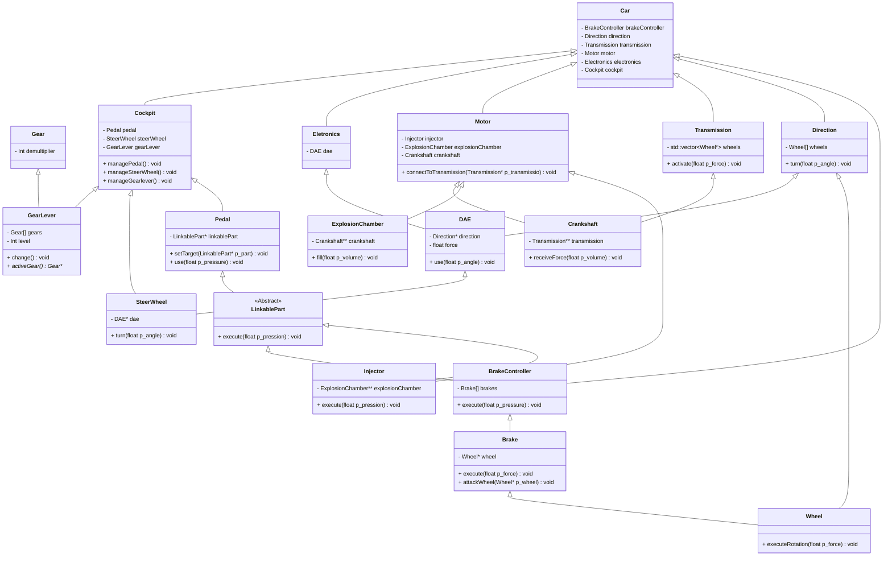

```mermaid
classDiagram
	class LinkablePart {
		<<Abstract>>
		+ execute(float p_pression) void
	}

	class Wheel {
		+ executeRotation(float p_force) void
	}

	class Gear {
		- Int demultiplier
	}

	Gear <|-- GearLever
	class GearLever {
		- Gear[] gears
		- Int level

		+ change() void
		+ activeGear() Gear**
	}

	Transmission <|-- Crankshaft
	class Transmission {
		- std::vector~Wheel*~ wheels

		+ activate(float p_force) void
	}

	class Crankshaft {
		- Transmission** transmission

		+ receiveForce(float p_volume) void
	}

	class ExplosionChamber {
		- Crankshaft** crankshaft

		+ fill(float p_volume) void
	}

	LinkablePart <|-- Injector
	class Injector {
		- ExplosionChamber** explosionChamber

		+ execute(float p_pression) void
	}

	Motor <|-- Injector
	Motor <|-- ExplosionChamber
	Motor <|-- Crankshaft
	class Motor {
		- Injector injector
		- ExplosionChamber explosionChamber
		- Crankshaft crankshaft

		+ connectToTransmission(Transmission* p_transmissio) void
	}

	Pedal <|-- LinkablePart
	class Pedal {
		- LinkablePart* linkablePart

		+ setTarget(LinkablePart* p_part) void
		+ use(float p_pressure) void
	}

	Direction <|-- Wheel
	Direction <|-- DAE
	class Direction {
		- Wheel[] wheels

		+ turn(float p_angle) void
	}

	DAE <|-- SteerWheel
	class DAE {
		- Direction* direction
		- float force

		+ use(float p_angle) void
	}

	class SteerWheel {
		- DAE* dae

		+ turn(float p_angle) void
	}

	Brake <|-- Wheel
	class Brake {
		- Wheel* wheel

		+ execute(float p_force) void
		+ attackWheel(Wheel* p_wheel) void
	}

	LinkablePart <|-- BrakeController
	BrakeController <|-- Brake
	class BrakeController {
		- Brake[] brakes

		+ execute(float p_pressure) void
	}

	Cockpit <|-- Pedal
	Cockpit <|-- SteerWheel
	Cockpit <|-- GearLever
	class Cockpit {
		- Pedal pedal
		- SteerWheel steerWheel
		- GearLever gearLever

		+ managePedal() void
		+ manageSteerWheel() void
		+ manageGearlever() void
	}

	Eletronics <|-- DAE
	class Eletronics {
		- DAE dae
	}

	Car <|-- BrakeController
	Car <|-- Direction
	Car <|-- Transmission
	Car <|-- Motor
	Car <|-- Eletronics
	Car <|-- Cockpit
	class Car {
		- BrakeController brakeController
		- Direction direction
		- Transmission transmission
		- Motor motor
		- Electronics electronics
		- Cockpit cockpit
	}

```